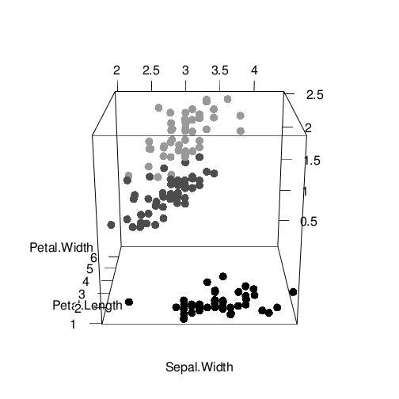

# WebGLで3Dデータの可視化

## `iris`データの3次元プロット

<canvas id="webgl_sample_01textureCanvas" style="display: none;" width="256" height="256">
 
	Your browser does not support the HTML5 canvas element.</canvas>
<!-- ****** points object 6 ****** -->

 
<!-- ****** text object 8 ****** -->

 
<!-- ****** text object 9 ****** -->

 
<!-- ****** text object 10 ****** -->

 
<!-- ****** lines object 11 ****** -->

 
<!-- ****** text object 12 ****** -->

 
<!-- ****** lines object 13 ****** -->

 
<!-- ****** text object 14 ****** -->

 
<!-- ****** lines object 15 ****** -->

 
<!-- ****** text object 16 ****** -->

 
<!-- ****** lines object 17 ****** -->

 

<canvas id="webgl_sample_01canvas" width="1" height="1"></canvas> 

 
	You must enable Javascript to view this page properly.

