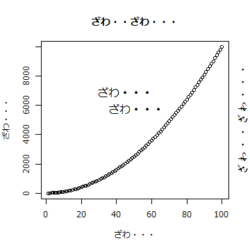

# プロットでの日本語フォントの利用 (Windows CP932)


このRマークダウンファイルはCP932(Shift_JIS)エンコーディングで保存してください。次のコマンドでHTMLファイルを作成できます。


```r
library(knitr)
opts_knit$restore()
opts_chunk$restore()
knit("ja-fig-win-CP932.Rmd")
Sys.setlocale(locale="C")
cat(iconv(markdown::markdownToHTML("ja-fig-win-CP932.md"),
	from="CP932", to="utf-8"),
	file = "ja-fig-win-CP932.html")
Sys.setlocale(locale="Japanese_Japan.932")
browseURL("ja-fig-win-CP932.html")
```





